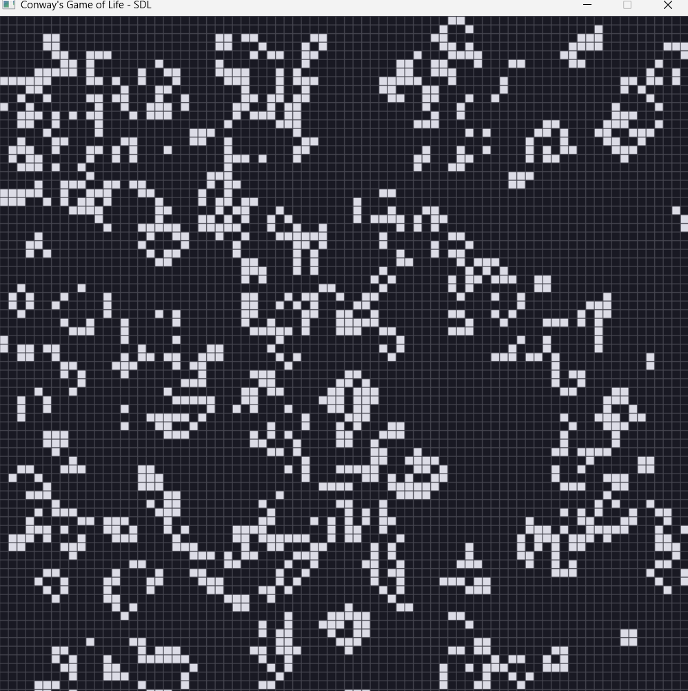

# PROGRAM 03 — Conway’s Game of Life (SDL2 Edition)
### **Nicole Vigilant**

---

## **Description**

This project upgrades the traditional terminal‐based **Conway’s Game of Life** into a fully interactive **SDL2 graphical application**.  
The simulator draws a grid of cells inside an SDL2 window and updates the grid according to Conway’s rules.

The program supports full interaction, including:

- SDL2 window and renderer  
- Drawing cells using filled rectangles  
- Clicking to toggle cells on/off  
- Pausing and stepping the simulation  
- Randomizing or clearing the grid  
- Loading Life patterns from `shapes.json`  
- Command-line configuration using JSON  

---

## **Files**

| # | File / Folder | Description |
|---|---------------|-------------|
| 1 | [`src/SDL_GOL_main.cpp`](src/SDL_GOL_main.cpp) | Main driver program. Handles SDL loop, input, JSON loading, simulation logic. |
| 2 | [`src/SdlScreen.cpp`](src/SdlScreen.cpp) | SDL2 renderer implementation. Draws grid and cells. |
| 3 | [`includes/SdlScreen.hpp`](Includes/SdlScreen.hpp) | Header for the SDL2 rendering class. |
| 4 | [`includes/CellularAutomaton.hpp`](Includes/CellularAutomaton.hpp) | Base automaton class that stores and updates the grid. |
| 5 | [`includes/ConwayLife.hpp`](Includes/ConwayLife.hpp) | Implements Conway’s Game of Life rules. |
| 6 | [`src/ConwayLife.cpp`](src/ConwayLife.cpp) | Step logic and grid update implementation. |
| 7 | [`includes/Screen.hpp`](Includes/Screen.hpp) | Abstract Screen interface for TextScreen and SdlScreen. |
| 8 | [`includes/ArgsToJson.hpp`](Includes/ArgsToJson.hpp) | Parses command line arguments into a JSON object. |
| 9 | [`includes/json.hpp`](Includes/json.hpp) | nlohmann/json library. |
|10 | [`assets/shapes.json`](Assets/shapes.json) | Pattern definitions. |
|11 | [`Makefile`](Makefile) | Automates the build process. |
|12 | `README.md` | Project documentation. |

---

### Instructions

1. Open **MSYS2 MinGW 64-bit** terminal.
2. Install SDL2:
   ```bash
   pacman -S mingw-w64-x86_64-sdl2
3. Naviagte into this program folder: cd 2143-OOP-vigilant/Assignments/Final\ Program
4. Build the program: use make
5. Run the program: ./SDL_GOL_main window_width=900 window_height=900 cellSize=12 frameDelayMs=60 or ./SDL_GOL_main

# 2. **Keyboard Controls Table**

### Controls

| Key | Action |
|-----|--------|
| **Space** | Pause & Resume simulation |
| **N** | Step forward 1 generation (pause required) |
| **R** | Randomize the grid |
| **C** | Clear the grid |
| **1** | Load the *glider* pattern from `shapes.json` at mouse position |
| **Left Mouse Click** | Toggle a cell on/off |
| **ESC** or **Q** | Quit the program |

## Screenshots

### Paused Mode


### Randomized Grid


### Pattern Loaded (Glider)


### 200+ Generations

